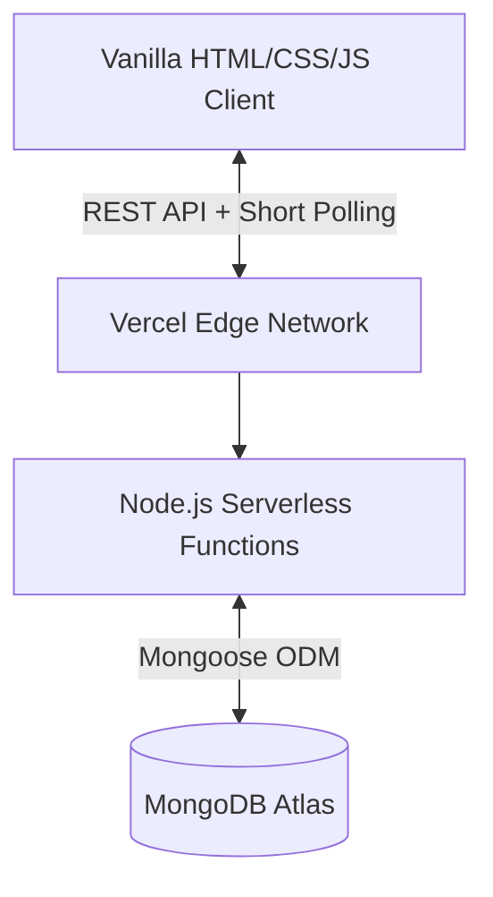

  
  <h1>🎟️ RaasPass Exchange</h1>
  
A high-performance, real-time P2P marketplace for Navaratri Garba Passes.

  

    
    
    
    
  

---

## 📖 Table of Contents
1. [System Architecture](#-system-architecture)
2. [Data Structures & Algorithms](#-data-structures--algorithms)
3. [Role-Based Access Control (RBAC)](#-rbac-matrix)
4. [API Reference](#-api-reference)
5. [Local Development](#-local-development)

---

## 🏗️ System Architecture

RaasPass leverages a modern decoupled architecture optimized for edge-network execution and blazing-fast cold starts.

### Key Architectural Decisions
- **Serverless Backend (`api/index.js`)**: Instead of a monolithic always-on server, compute is spun up on-demand via Vercel Edge functions, resulting in near-zero idle cost.
- **Neo-Minimalist UI**: Built entirely without heavy frontend frameworks (React/Vue) to ensure sub-second TTI (Time to Interactive). Interactions are smoothed using CSS hardware acceleration and graceful degradation skeleton models.
- **Real-Time Diffing**: Implemented a background Short Polling mechanism (`setInterval`) that silently fetches data and compares object hashes to prevent DOM flickering.

---

## 🧠 Data Structures & Algorithms

To ensure the marketplace remains highly performant at scale, raw arrays have been replaced with optimal fundamental Data Structures.

| Data Structure | Location | Time Complexity | Use Case |
| :--- | :--- | :--- | :--- |
| **Trie (Prefix Tree)** | `script.js` | $O(W \cdot L)$ | Autocomplete search for Event Names. Bypasses standard $O(N \cdot M)$ string matching by traversing tree nodes char-by-char. |
| **Min-Heap** | `script.js` | $O(N \log N)$ | Client-side lowest-price sorting. Guarantees the absolute cheapest passes bubble to the root node instantly. |
| **Max-Heap (Priority Queue)** | `api/index.js` | $O(\log N)$ | Server-side ranking engine. Boosted (`isBoosted: true`) listings are assigned higher weights and bubble to the top of the feed, while maintaining O(1) peek time. |
| **Fixed-Size Queue** | `script.js` | $O(1)$ | Maintains a sliding window of the user's 5 most "Recent Searches". Oldest queries are evicted (dequeued) securely. |

---

## 🔐 RBAC Matrix

To protect user data and ensure contact details are only released securely, RaasPass implements a strict Role-Based Access Control matrix within the `Listing` and `User` models.

| Permission | Guest User (Unauthenticated) | Authenticated User (Buyer) | Seller (Owner of Listing) |
| :--- | :---: | :---: | :---: |
| Browse Public Listings | ✅ | ✅ | ✅ |
| Search via Trie | ✅ | ✅ | ✅ |
| View Seller Contact Info | ❌ | ✅ *(Requires Purchase)*| ✅ |
| Create New Listing | ❌ | ✅ | ✅ |
| Mark Listing as Sold | ❌ | ❌ | ✅ |
| Boost Listing Visibility | ❌ | ❌ | ✅ |

---

## 🔌 API Reference

The backend exposes a highly RESTful JSON API. All routes are prefixed with `/api`.

### Endpoints

#### `POST /register`
Creates a new user account with hashed passwords.
- **Body**: `{ "username": "JohnDoe", "password": "secure123", "phoneNumber": "1234567890" }`
- **Response**: `201 Created`

#### `POST /login`
Authenticates a user and returns an session token/ID.
- **Body**: `{ "username": "JohnDoe", "password": "secure123" }`
- **Response**: `200 OK`

#### `GET /listings`
Fetches all active listings. Combines MongoDB query filters with an in-memory Priority Queue sort.
- **Query Params** (Optional): `?city=Ahmedabad&passType=Single&date=2024-10-15`
- **Response**: `200 OK` (`Array<Listing>`)

#### `POST /listings`
Creates a new marketplace listing.
- **Body**: `{ "eventName": "Garba Fest", "city": "Surat", "price": 1500, "date": "...", "sellerId": "..." }`
- **Response**: `201 Created`

#### `POST /listings/:id/purchase`
Executes a pseudo-escrow transaction, revealing the highly guarded `contactInfo` string to the requesting buyer.
- **Body**: `{ "userId": "..." }`
- **Response**: `200 OK` (`{ "contactInfo": "1234567890" }`)

#### `POST /listings/:id/boost`
Flags a listing as `isBoosted = true`, instantly raising its priority weight in the backend Max-Heap algorithm.
- **Response**: `200 OK`

---

## 🚀 Local Development

### Prerequisites
- Node.js (v18+)
- Vercel CLI (`npm i -g vercel`)
- MongoDB Local/Atlas Connection URI

### Installation & Run
1. Clone the repository: `git clone https://github.com/your-repo/navaratri-pass.git`
2. Install the backend dependencies: `npm install`
3. Link to Vercel and boot the edge runtime: `vercel dev`

The serverless development environment will automatically map `/api` requests to `index.js` while serving the frontend statics at `http://localhost:3000`.
